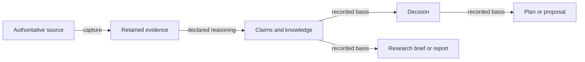

# Justification

The MVP is in development. [Acceptance evidence](docs/implementation/acceptance.md)
tracks what has been verified and what remains to be completed.

Justification is a local-first, vendor-neutral knowledge and justification
system for agentic work. It helps people and agents accumulate knowledge,
trace decisions to their evidence and reasoning, and create knowledge outputs
that remain connected to their basis.

Knowledge outputs include research briefs, reports, plans, proposals, PRDs and
ADRs. Knowledge can be useful before a decision is made or an output is
written. The same graph preserves sources, evidence, claims, assumptions,
requirements, open questions and their relationships across sessions and
outputs. Providers remain authoritative for the information they supply.



`why` follows recorded reasoning back to its basis. `impact` follows declared
dependencies forward to knowledge and outputs that may need reassessment.

The MVP stores semantic history in an append-only, integrity-checked native
project and generates a readable OKF projection. A source change can therefore
show which evidence, claims, decisions and artifacts need review without
rewriting the historical explanation of the decision.

Requirements and installation

Use the Node version in [.nvmrc](.nvmrc) (currently `24.21.0`). From a checkout:

```sh
npm ci
npm run build
```

The build emits `dist/index.js` and `dist/cli.js`. Run the CLI directly with
`node dist/cli.js`, or install this checkout into another project with
`npm install /path/to/justification` to use its package export and binary.

The first end-to-end validation uses a fictional research brief and exercises
the general knowledge workflow without requiring a decision record. Run it
with:

```sh
npm run demo
node examples/knowledge-output-demo.mjs --root /path/to/an/empty/directory
```

The script captures a fictional survey and independent notes, records claims
with explicit support, writes a research brief with a direct claim basis,
retains an open question, changes only the survey, and checks exact affected
and unaffected sets plus historical `why`. It leaves the generated directory
in place and prints its paths and stable IDs. The fixture narrative is in
[examples/knowledge-output-fixture.md](examples/knowledge-output-fixture.md).

The original ADR scenario remains available as a second general-product
example:

```sh
npm run demo:adr
node examples/adr-demo.mjs --root /path/to/an/empty/directory
```

It captures a fictional benchmark, records options and a constraint, follows
evidence through a claim and decision to an ADR artifact, changes the source,
checks review impact and unchanged refresh idempotence, and rebuilds the
disposable index.

Use the runtime, CLI and MCP server

The public runtime exports `initializeProject(root)`,
`discoverProjects(roots)` and one dispatcher, `executeOperation(root, request)`.
The dispatcher is the semantic owner shared by the CLI and MCP transports. See
[docs/usage.md](docs/usage.md) for request examples and the complete operation
surface, and [docs/implementation/runtime-api.md](docs/implementation/runtime-api.md)
for the TypeScript request union.

The CLI keeps JSON on stdout and structured errors on stderr:

```sh
justification init /path/to/project
justification projects /path/to/project /path/to/another-project
justification run /path/to/project request.json
cat request.json | justification run /path/to/project -
justification mcp /path/to/project /path/to/another-project
```

`run` accepts every runtime operation. `mcp` starts one local stdio server and
only routes requests to the project roots supplied at launch. Do not put an
arbitrary request-time filesystem root in an MCP request; select one of the
configured project IDs returned by discovery.

Native backup and OKF export

For a native backup, preserve `justification.json`, the complete
`justification-history/` directory and the current `kb/` projection. Source
files are provider-owned and must be backed up separately when they matter to
future refreshes. The disposable `.justification/` index can be removed and
rebuilt from native history.

An `export` operation writes the current readable OKF v0.2 projection under the
project root. A different output directory is not supported in this MVP. It is
a useful portable reading view, but it does not contain the complete native
revision history or enough information to reproduce historical `why` queries
on its own. Generic OKF import, lossless editing and legacy migration are
outside this MVP. See
[docs/recovery.md](docs/recovery.md) for corruption, lock and projection-drift
recovery.

The optional [Justification agent skill](skills/justification/SKILL.md) teaches
an agent to discover scope, capture observations before interpretation, inspect
support and review impact, and preserve native history.

Project language and design records

- [Domain language](CONTEXT.md)
- [MVP implementation contract](docs/planning/mvp-contract.md)
- [Runtime and CLI usage](docs/usage.md)
- [Recovery and backup](docs/recovery.md)
- [ADR fixture](examples/adr-fixture.md)
- [Durable revisions and OKF projections](docs/adr/0001-durable-revisions-and-okf-projections.md)
- [Declared support and conservative review](docs/adr/0002-declared-support-and-conservative-review.md)
- [Project scope and file provider](docs/adr/0003-project-scope-and-file-provider.md)

Licensed under the [MIT License](LICENSE).
